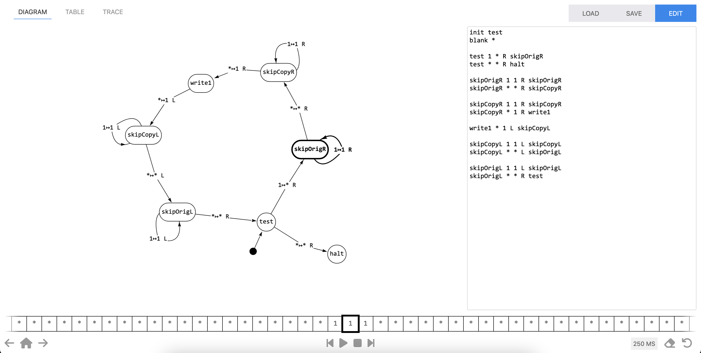

# Turing machine visualizer and analyzer

[](https://github.com/fbbdev/turing/actions/workflows/webpack.yml)

Teachers and tutors of theoretical computer science courses often face the dual
problem of *(a)* helping novice students to become acquainted with the somewhat
counterintuitive discipline of Turing machine design and interpretation, and on
the other hand *(b)* interpreting and assessing their students' output which
— due to the aforementioned lack of intuition — can often get quite convoluted
itself.

This project is an attempt at developing tools that may help solve both sides
of the problem; first, by providing a graphical environment in which the
structure and behavior of machine designs can be visualized and explored
intuitively; second, by providing tools for assisted (and partially automated)
analysis of their behavior in terms of a higher level description language.

It grew out of dissatisfaction with the tools already available on the internet,
which are either too inflexible (i.e. limited in their functionality) or sport
outdated and/or uncomfortable user interfaces.

## Try it

This is a browser-based application. A fully functional build is available
[here](https://fbbdev.it/turing/).
For a guide to the [description language](#description-language) and some
[examples](#examples), see below.

Here is a screenshot of the main view, showing the transition diagram of a
machine on the left and its low level textual description on the right:



## Building from source

In order to build the application yourself, clone the repository and run
```
$ npm install
```
Then run
```
$ npm run build
```
for the production mode build (optimized and minified), or
```
$ npm run build-dev
```
for the development build. Finally, run
```
$ npm run serve
```
to start a minimal webserver hosting the application. The build scripts invoke
webpack under the hood.

If you update the grammar of the description language
([`src/spec.pegjs`](src/spec.pegjs)), you must run
[peggy](https://peggyjs.org/) to regenerate the javascript parser code. The
following command
```
$ npm run peg
```
invokes the peggy binary with the right options.

## Roadmap

At present, only the first part of the project is developed and already quite
usable. It takes as input a low level textual description of a Turing machine
and provides an interactive visualization of the transition diagram and table,
together with a tape editor and navigator and tools for running the program.
There is still room for improvement, for example by adding a suite of keyboard
shortcuts, graphical editing tools and code navigation utilities.

Eventually, a high-level description language (with composable blocks and
structured control flow) will be implemented together with tools for
reverse-engineering a high-level description from a low-level one. Ideally,
once a high-level description is available, the application should be able to
extract hints from it for an improved visualization.

A Turing machine program is essentially a set of labeled code blocks each
comprising exactly a load, a branch on the loaded value, a store, a pointer
update and a jump. The idea is to apply well-known decompilation techniques
to recover structured flow control constructs from the transition graph.

- [ ] Description editor
  - [x] Load and export code
  - [x] Error highlighting
  - [ ] Code navigation and refactoring tools
  - [ ] Keyboard shortcuts
- [ ] Visualization
  - [x] Interactive view of the transition diagram
  - [x] Transition table
  - [ ] Tape editor
    - [x] Keyboard based input
    - [x] Paste from clipboard
    - [x] Navigation shortcuts
    - [ ] Jump to leftmost and rightmost non-blank symbol
- [ ] Simulation
  - [x] Pause/Resume simulation
  - [x] Simulation speed selector
  - [x] Manual stepping
  - [x] Execution trace inspector
  - [ ] Keyboard shortcuts
- [ ] Analysis
  - [ ] Comment syntax
  - [ ] High-level description language
  - [ ] Basic block/Branch/Loop/Register discovery
  - [ ] Code deduplication
  - [ ] Automated analysis algorithms
- [ ] Documentation
    - [x] Low-level description language
    - [ ] High-level description language
    - [ ] GUI documentation
    - [ ] Shortcut reference
    - [ ] Popup-based tutorial

## Low-level description language

The low-level description language is just a list of transitions, preceded by
two mandatory directives defining the initial state and the blank symbol, and
a variable number of directives defining accepting and rejecting states. At the
moment, support for comments is planned but not implemented.

The symbol alphabet is taken to be the set of all non-whitespace characters.
The blank symbol (specified in the description) is used to mark empty cells on
the tape. States are represented by strings of non-whitespace characters and
are created automatically as soon as they appear in the description.
Transitions are required to be strictly deterministic (i.e. at present only
deterministic TMs may be described and simulated); an error message is
displayed when this is not the case. Accepting and rejecting states are purely
cosmetic, i.e. they are marked in green and red, respectively, in the
resulting diagram. The simulation may halt in any state, whenever no transition
is found matching the current state and tape symbol.

The general structure of a description is as follows; three examples can be
found in the next section.
```
init INIT_STATE
blank SYMBOL

[accept STATE]
[reject STATE]
...

PREV_STATE INPUT_SYMBOL OUTPUT_SYMBOL MOVE NEXT_STATE
...
```
The parser is case-sensitive. The lowercase keywords `init`, `blank`, `accept`
and `reject` are reserved (i.e. they cannot be used as state names). `init`
and `blank` directives are mandatory and must appear only once, at the
beginning, in the order shown above. `accept` and `reject` directives are
optional, may appear any number of times in any order, and must appear before
the list of transitions. The transition list may contain arbitrarily many rows
(it may even be empty). Directives and transitions may be surrounded and
interspersed by any amount of whitespace, but cannot be broken into multiple
lines, and must be terminated by a newline.

The placeholders must be replaced as follows:
  - `INIT_STATE`, `STATE`, `PREV_STATE`, `NEXT_STATE`: any sequence of
  non-whitespace characters excluding the four keywords listed above;
  - `SYMBOL`, `INPUT_SYMBOL`, `OUTPUT_SYMBOL`: any non-whitespace character;
  - `MOVE`: either `L` (left), `R` (right) or `N` (no move).

## Examples

<details>
<summary>Unary multiplication by 2</summary>

A machine that reads from the tape an integer in _unary_ notation (_n_ is
represented by a list of _n_ occurrences of the symbol `1`) and writes it back
doubled.

[Load in the simulator](https://fbbdev.it/turing/?fetch=https%3A%2F%2Fraw.githubusercontent.com%2Ffbbdev%2Fturing%2Fmain%2Fexamples%2FunaryDup.txt)

_Instructions:_ click the link above; when the machine has been loaded, click
the tape head (the cell with a large black border), type `1` as many times as
you like, press the `Enter` key and hit the play button.

```
init test
blank *

test 1 * R skipOrigR
test * * R halt

skipOrigR 1 1 R skipOrigR
skipOrigR * * R skipCopyR

skipCopyR 1 1 R skipCopyR
skipCopyR * 1 R write1

write1 * 1 L skipCopyL

skipCopyL 1 1 L skipCopyL
skipCopyL * * L skipOrigL

skipOrigL 1 1 L skipOrigL
skipOrigL * * R test
```
</details>

<details>
<summary>Binary increment by one</summary>

A machine that reads from the tape an integer in _binary_ notation and writes
it back incremented by one.

[Load in the simulator](https://fbbdev.it/turing/?fetch=https%3A%2F%2Fraw.githubusercontent.com%2Ffbbdev%2Fturing%2Fmain%2Fexamples%2FbinaryIncr.txt)

_Instructions:_ click the link above; when the machine has been loaded, click
the tape head (the cell with a large black border), type a sequence of `1`s and
`0`s, press the `Enter` key and hit the play button.

```
init q0
blank *

q0 * * L q1
q0 0 0 R q0
q0 1 1 R q0

q1 * 1 L q2
q1 0 1 L q2
q1 1 0 L q1

q2 * * R halt
q2 0 0 L q2
q2 1 1 L q2
```
</details>

<details>
<summary>Binary addition</summary>

A machine that reads from the tape two integers in _binary_ notation, separated
by a blank, and writes back their sum.

[Load in the simulator](https://fbbdev.it/turing/?fetch=https%3A%2F%2Fraw.githubusercontent.com%2Ffbbdev%2Fturing%2Fmain%2Fexamples%2FbinaryAdd.txt)

_Instructions:_ click the link above; when the machine has been loaded, click
the tape head (the cell with a large black border), type a sequence of `1`s and
`0`s, press `Space`, then type again a sequence of `1`s and `0`s, press the
`Enter` key and hit the play button.

```
init test
blank *

test 0 0 R skipO1
test 1 1 R skipO1
test * * R halt

skipO1 z z R skipO1
skipO1 o o R skipO1
skipO1 0 0 R skipO1
skipO1 1 1 R skipO1
skipO1 * * R getO2

getO2 * * L rewrite
getO2 0 0 R getO2_0
getO2 1 1 R getO2_1

getO2_0 0 0 R getO2_0
getO2_0 1 1 R getO2_1
getO2_0 * * L biteO2_0

getO2_1 0 0 R getO2_0
getO2_1 1 1 R getO2_1
getO2_1 * * L biteO2_1

biteO2_0 0 * L rskipO2_0

biteO2_1 1 * L rskipO2_1

rskipO2_0 0 0 L rskipO2_0
rskipO2_0 1 1 L rskipO2_0
rskipO2_0 * * L add_0

add_0 z z L add_0
add_0 o o L add_0
add_0 0 z R skipO1
add_0 1 o R skipO1
add_0 * z R skipO1

rskipO2_1 0 0 L rskipO2_1
rskipO2_1 1 1 L rskipO2_1
rskipO2_1 * * L add_1

add_1 z z L add_1
add_1 o o L add_1
add_1 0 o R skipO1
add_1 1 z L incr
add_1 * o R skipO1

incr 1 0 L incr
incr 0 1 R skipO1
incr * 1 R skipO1

rewrite * * L rewrite'

rewrite' z 0 L rewrite'
rewrite' o 1 L rewrite'
rewrite' 0 0 L rewrite'
rewrite' 1 1 L rewrite'
rewrite' * * R halt
```
</details>

## Acknowledgements

The diagram viewer is based upon the
[vis-network](https://visjs.github.io/vis-network/docs/) library from the
awesome [vis.js](https://visjs.org/) project.

The description language parser is generated from a grammar description using
[peggy](https://peggyjs.org/).

The graphical user interface is built with the [UIkit 3](https://getuikit.com/)
framework and the [mustache](https://mustache.github.io/) logic-less templating
engine.

## License

Copyright (C) 2023 Fabio Massaioli

This program is free software: you can redistribute it and/or modify
it under the terms of the GNU General Public License as published by
the Free Software Foundation, either version 3 of the License, or
(at your option) any later version.

This program is distributed in the hope that it will be useful,
but WITHOUT ANY WARRANTY; without even the implied warranty of
MERCHANTABILITY or FITNESS FOR A PARTICULAR PURPOSE.  See the
GNU General Public License for more details.

You should have received a copy of the GNU General Public License
along with this program.  If not, see <https://www.gnu.org/licenses/>.
